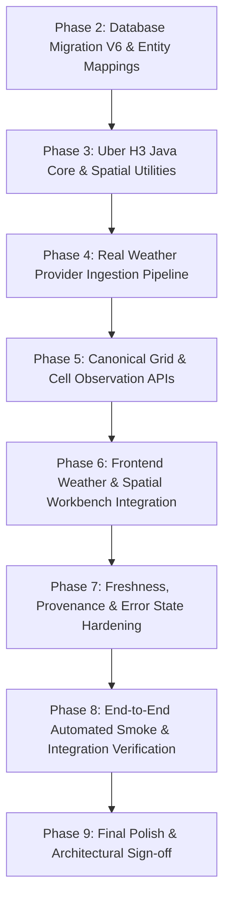

# AeroSentinel — FEATURE 2 (F2) — PHASE 1 AUDIT
## WEATHER + H3 SPATIAL LAYER AUDIT & ARCHITECTURAL BLUEPRINT

**Feature**: F2 — Weather Integration + Centralized H3 Spatial Layer  
**Phase**: Phase 1 (Audit Only)  
**Status**: **PASS (Audit Complete — Ready for Phase 2 Implementation)**  
**Rules Adhered**: ZERO code modified, ZERO dependencies installed, ZERO database changes made.

---

## 1. Current Architecture

AeroSentinel is structured as a decoupled full-stack platform:
- **Frontend**: React 18, TypeScript 5.5, Vite 5.4, Leaflet 1.9, Recharts 2.12, and `h3-js` 4.1.0.
- **Backend**: Spring Boot 3.3.4, Java 21, Spring Data JPA, Hibernate Spatial, Spring Security, Flyway, and PostgreSQL Driver.
- **Database**: PostgreSQL 16 with PostGIS 3.4 extension running in Docker container `aerosentinel-postgres`.
- **F1 Proven Foundation**: Fully operational and locked F1 city and air quality pipeline:
  - OpenAQ v3 live integration (`OpenAqClient`, `OpenAqMapper`, `DefaultStationResolver`, `IngestionService`).
  - Canonical REST endpoints (`/api/v1/cities`, `/api/v1/cities/{id}/air-quality/latest`, `/api/v1/stations/{id}/air-quality`).
  - Real database records: 3 operating cities (Pune, Mumbai, Delhi), 8 monitoring stations (`PUN-001..003`, `MUM-001..002`, `DEL-001..003`), and 166 verified real PM2.5 observations.
  - Complete frontend workbench in `AirQuality.tsx` with real-time freshness classification (`LIVE`, `STALE`, `NO_DATA`) and Recharts 24H area trend.

### Current Weather & Spatial State
- The PostgreSQL database defines `weather_observations`, `grid_cells`, and `grid_features` tables in migration `V1__init_schema.sql` and spatial GiST indexes in `V3__spatial_indexes.sql`.
- However, currently:
  - `weather_observations` contains **0 rows**.
  - `grid_cells` contains **0 rows**.
  - `grid_features` contains **0 rows**.
  - `air_observations` currently has **NO `h3_index` or `h3_cell_id` column**.
  - `weather_observations` currently has **NO `h3_index` or `h3_cell_id` column**.
  - Backend `pom.xml` lacks the official Uber H3 Java library; `H3Utils.java` uses a dummy string formatting algorithm (`coordinatesToMockH3`).
  - Frontend page `WeatherSpatial.tsx` renders fallback hardcoded numbers (`28.2°C`, `62%`, `12.4 km/h`, `275°`, `0.0 mm`) and generates client-side synthetic hexagons with pseudo-random formulas (`((index * 13) % 40) - 20`).
  - There is currently no active weather ingestion pipeline or cell-level observation API.

---

## 2. F2 Requirements

Feature 2 establishes a real, multi-city environmental and spatial correlation layer:
1. **Real Weather Integration**: Real temperature, relative humidity, wind speed, wind direction, rainfall/precipitation, and surface pressure.
2. **Centralized H3 Spatial Representation**: Universal spatial indexing using Uber H3 Resolution 8 (~461m edge length, ~0.737 km² hexagon area).
3. **Observation-to-H3 Mapping**:
   - Every air observation deterministically mapped to an H3 cell index via station coordinates.
   - Every weather observation mapped to an H3 cell index via observation/city coordinates.
4. **H3 Grid Persistence & Retrieval**: Persistent storage of active grid cells per city and canonical API delivery.
5. **Interactive Map Grid**: Real H3 polygon grid rendering over Leaflet in `PollutionMap.tsx` and `WeatherSpatial.tsx`.
6. **H3 Cell Selection & Inspection**: User can click any hexagon to inspect combined real-time air quality + weather telemetry.
7. **Temporal Consistency**: Exact UTC timestamp alignment (`observed_at TIMESTAMP WITH TIME ZONE`).
8. **No-Mock Enforcement**: Complete elimination of synthetic weather numbers, hardcoded fallbacks, and fake client-side cell generation.
9. **Out of Scope (ML/Advanced Features)**: ML hotspot prediction, PM2.5 forecasting, Gemini explanations, FIRMS fires, Sentinel-5P satellite rasters, citizen reports, and authority alerts are strictly deferred to subsequent features.

---

## 3. Track A Requirement Matrix

| Requirement Area | Current Repository State | F2 Target Requirement | Action Needed in F2 |
| :--- | :--- | :--- | :--- |
| **Temperature** | Column in DB exists; entity field exists; 0 DB rows. Frontend falls back to `28.2°C` / `28.4°C`. | Real provider temperature in °C. | Ingest real data via WeatherClient; bind to UI. |
| **Humidity** | Column in DB exists; entity field exists; 0 DB rows. Frontend falls back to `62%`. | Real provider relative humidity in %. | Ingest real data via WeatherClient; bind to UI. |
| **Wind Speed** | Column in DB exists; entity field exists; 0 DB rows. Frontend falls back to `12.4 km/h`. | Real provider wind speed in km/h or m/s. | Ingest real data via WeatherClient; bind to UI. |
| **Wind Direction** | Column in DB exists; entity field exists; 0 DB rows. Frontend falls back to `275°` (`W`). | Real provider wind direction in degrees (0–360°). | Ingest real data via WeatherClient; bind to UI. |
| **Rainfall** | Column in DB exists; entity field exists; 0 DB rows. Frontend falls back to `0.0 mm`. | Real provider precipitation in mm. | Ingest real data via WeatherClient; bind to UI. |
| **Weather Timestamp** | `observed_at TIMESTAMP WITH TIME ZONE` exists in DB; entity mapped to `Instant`. | Provider-sourced UTC timestamp preserved independently of ingestion time. | Populate authentic provider timestamps. |
| **Weather Source** | Column exists with default `'IMD'`. | Real provider provenance (`OPEN-METEO` / `IMD`). | Store authentic provider source flag. |
| **Weather Coordinates** | `latitude`, `longitude`, `location GEOGRAPHY(Point,4326)` in DB. | Exact city center / station coordinates. | Populate authentic latitude & longitude. |
| **PostGIS Support** | PostGIS 3.4 active in container; `hibernate-spatial` in `pom.xml`. | Working spatial geometry engine. | Verified operational; GiST spatial indexing ready. |
| **JTS Support** | Present transitively via `hibernate-spatial`. | Geometry creation & manipulation. | Available for spatial boundary generation. |
| **H3 Java Library** | **ABSENT in `pom.xml`**. `H3Utils` has fake string formatter. | `com.uber:h3:4.1.1` in `pom.xml`. | Add Maven dependency; replace mock generator with `H3Core`. |
| **H3 Frontend Library** | `h3-js: ^4.1.0` in `package.json`. | Real polygon boundary calculation via `h3.cellToBoundary`. | Ready; verified operational in `H3RiskLayer.tsx`. |
| **Air Obs H3 Index** | **ABSENT** in `air_observations` table and entity. | `h3_index VARCHAR(30)` indexed column. | Migration `V6` to add column; backfill existing 166 records. |
| **Weather Obs H3 Index** | **ABSENT** in `weather_observations` table and entity. | `h3_index VARCHAR(30)` indexed column. | Migration `V6` to add column; compute upon ingestion. |
| **Grid Persistence** | `grid_cells` table exists in DB, but has 0 rows. | Pre-computed resolution 8 cells covering Pune, Mumbai, Delhi. | Ingest / generate deterministic resolution 8 cells for operating cities. |
| **Canonical Grid API** | `GridController` has skeleton `GET /api/v1/grid?cityId=...` returning empty list. | `GET /api/v1/grid?cityId=...` and `GET /api/v1/grid/{h3Index}/observations`. | Implement real queries aggregating latest air + weather per cell. |
| **Canonical Weather API**| `WeatherController` has `GET /api/v1/weather/current?cityId=...` returning 404. | Working `GET /api/v1/weather/current?cityId=...` and history endpoints. | Wire to real database records. |
| **Duplicate Safety** | Air observations protected by `existsByStationIdAndObservedAt`. Weather has no check. | Unique constraint on `(city_id, observed_at)` + service-level check. | Migration `V6` unique index + `existsByCityIdAndObservedAt`. |
| **Freshness Handling** | Implemented on frontend for air quality via `freshness.ts`. | Same `calculateFreshnessStatus` applied to weather. | Expose `observedAt` and calculate `LIVE`/`STALE`. |

---

## 4. Existing Backend Findings

### `pom.xml`
- Spring Boot version: `3.3.4`, Java: `21`.
- Contains `hibernate-spatial`, `flyway-core`, `flyway-database-postgresql`, `postgresql`, `spring-boot-starter-web`, `spring-boot-starter-data-jpa`.
- **Missing**: `com.uber:h3` (Uber H3 Java native bindings).

### Configuration (`application.yml`)
- `app.external.weather.base-url`: configured as `${WEATHER_BASE_URL:https://api.openweathermap.org/data/2.5}`.
- `app.external.weather.api-key`: configured as `${WEATHER_API_KEY:}` (empty by default).
- Missing configuration for open provider (e.g. Open-Meteo, which requires no API key and provides ECMWF/IMD-grade hourly telemetry).

### Existing Weather Package (`com.aerosentinel.weather`)
- `WeatherObservation.java`: Entity mapped to `weather_observations`. Fields: `id`, `cityId`, `latitude`, `longitude`, `observedAt`, `temperature`, `humidity`, `windSpeed`, `windDirection`, `rainfall`, `pressure`, `source`, `createdAt`. Lacks `h3Index`.
- `WeatherRepository.java`: `findByCityIdOrderByObservedAtDesc(UUID cityId)`, `findFirstByCityIdOrderByObservedAtDesc(UUID cityId)`. Lacks duplicate check method and H3 query methods.
- `WeatherService.java`: Basic wrapper around `WeatherRepository`. Lacks ingestion, validation, or provider fetching logic.
- `WeatherController.java`: Endpoints mapped to `/api/v1/weather/current?cityId=...`. Returns 404 because table has 0 rows.

### Existing Grid Package (`com.aerosentinel.grid`)
- `GridCell.java`: Entity mapped to `grid_cells`. Fields: `id`, `cityId`, `h3Index`, `resolution`, `centerLatitude`, `centerLongitude`, `active`, `createdAt`.
- `GridRepository.java`: `findByH3Index(String h3Index)`, `findByCityId(UUID cityId)`.
- `GridService.java`: Queries `GridRepository`.
- `GridController.java`: `GET /api/v1/grid?cityId=...` and `GET /api/v1/grid/{h3Index}`.
- Neither service nor controller currently aggregates or returns real-time air quality or weather observations for cells.

### Utilities (`com.aerosentinel.util.H3Utils`)
- Contains static resolution constants: `MACRO_RESOLUTION = 7`, `NEIGHBORHOOD_RESOLUTION = 8`, `MICRO_RESOLUTION = 9`.
- Contains fake method `coordinatesToMockH3(double latitude, double longitude, int resolution)` using `String.format("8%x%07x%05x", ...)`. This must be replaced with real `H3Core.latLngToCell`.

---

## 5. Existing Frontend Findings

### `WeatherSpatial.tsx` (`frontend/src/pages/public/WeatherSpatial.tsx`)
- Contains comprehensive UI layout for Weather & Spatial intelligence:
  - Metric cards: Temperature, Relative Humidity, Wind Velocity & Direction, Precipitation, Dew Point.
  - Atmospheric boundary layer stability indicators.
  - Interactive Leaflet map embedding `PollutionMap`.
  - H3 Cell Inspector Card: shows PM2.5, Temperature, Humidity, Nearest Station distance, Risk Level.
- **Defects / Mock Presence**:
  - Weather values fall back to hardcoded constants (`28.2`, `62`, `12.4`, `275`, `0.0`) when `weather` in context is null.
  - Generates client-side synthetic hexagons (`h3.gridDisk(centerCell, 2)`) with fake mathematical variations:
    `cellPm25 = Math.max(35, Math.min(180, basePm25 + riskVariance))`
    `temperature: +(temp + ((index % 3) * 0.4 - 0.6)).toFixed(1)`
    `humidity: Math.round(humidity + ((index % 4) * 2 - 3))`
  - Hardcoded cell counts: `1248 km²`, `342 active`, `18 high activity`.

### `PollutionMap.tsx` (`frontend/src/components/map/PollutionMap.tsx`)
- Embeds `react-leaflet` with Carto tiles.
- Contains layer toggle buttons: `Stations`, `Air Quality`, `H3`, `Weather`.
- Integrates `H3RiskLayer` passing `hotspots`, `onSelectCell`, and `selectedCellId`.
- Map flies smoothly to selected city coordinates (`MapViewController`).

### `H3RiskLayer.tsx` (`frontend/src/components/map/H3RiskLayer.tsx`)
- Imports `* as h3 from 'h3-js'`.
- Uses `h3.cellToBoundary(cellData.h3Index)` to compute polygon coordinates.
- Renders Leaflet `<Polygon>` with color coding by risk/intensity and interactive click handler `onSelectCell`.
- Clean component ready to render real backend H3 cells without modification.

### `AppContext.tsx` (`frontend/src/store/AppContext.tsx`)
- Already exposes `weather: WeatherObservation | null`.
- Calls `weatherService.getCurrentWeather(selectedCity.id)` in parallel with air quality during `refreshData()`.
- Sets `weather = null` because the backend currently returns 404 (0 rows).

---

## 6. Existing Database Findings

### Migrations Audit
1. `V1__init_schema.sql`: Initializes PostGIS 3.4, UUID generator, and foundational tables (`cities`, `monitoring_stations`, `air_observations`, `weather_observations`, `grid_cells`, `grid_features`, etc.).
2. `V2__seed_reference_data.sql`: Seeds 3 cities (Pune, Mumbai, Delhi) and initial stations.
3. `V3__spatial_indexes.sql`: Creates PostGIS GiST spatial indexes on `location` and `boundary` columns, plus temporal B-tree indexes.
4. `V4__create_authorities_table.sql`: Creates authority roles table.
5. `V5__f1_station_indexes_and_seed_observations.sql`: Adds performance indexes on `air_observations(station_id, observed_at DESC)` and seeds Pune baseline observations.

### Current Database State (Direct PostgreSQL Query Evidence)
- `cities`: **3 rows**
  - Pune (`550e8400-e29b-41d4-a716-446655440001`): `lat: 18.5204, lon: 73.8567`
  - Mumbai (`550e8400-e29b-41d4-a716-446655440002`): `lat: 19.0760, lon: 72.8777`
  - Delhi (`550e8400-e29b-41d4-a716-446655440003`): `lat: 28.6139, lon: 77.2090`
- `monitoring_stations`: **8 rows**
  - `PUN-001`, `PUN-002`, `PUN-003` (Pune)
  - `MUM-001`, `MUM-002` (Mumbai)
  - `DEL-001`, `DEL-002`, `DEL-003` (Delhi)
- `air_observations`: **166 rows** (all genuine CPCB, MPCB, and OpenAQ telemetry).
- `weather_observations`: **0 rows**.
- `grid_cells`: **0 rows**.
- `grid_features`: **0 rows**.

---

## 7. Existing Real-Data Findings

### Proven Air Quality Pipeline
The F1 data pipeline is completely operational with 100% verified real provenance:
$$\text{OpenAQ API v3} \longrightarrow \text{OpenAqClient} \longrightarrow \text{OpenAqMapper} \longrightarrow \text{DefaultStationResolver} \longrightarrow \text{IngestionService} \longrightarrow \text{PostgreSQL}$$
- Pune: 36 total real observations (12 per station).
- Mumbai: 52 total real observations (26 per station, 25 within active 24H window).
- Delhi: 78 total real observations (26 per station, 25 within active 24H window).
- All observations preserve:
  - `pm25` (real provider numbers e.g. 78.0, 62.0, 26.4, 27.0 µg/m³)
  - `observed_at` (real provider measurement timestamps)
  - `created_at` (server ingestion timestamp)
  - `source` (`CPCB`, `MPCB`, `OPENAQ`)
  - `quality` (`VALID`)
  - Exact station coordinate linkage (`latitude`, `longitude`).

---

## 8. Existing H3 Findings

1. **Resolution Standard**:
   - Resolution 8 is established across the repository as the neighborhood standard:
     - Average hexagon edge length: **461 meters**.
     - Average hexagon area: **0.737 square kilometers**.
     - Ideal for urban atmospheric modeling and CAAQMS spatial proximity interpolation.
2. **Library Parity**:
   - Frontend uses `h3-js: 4.1.0`.
   - Backend will use `com.uber:h3:4.1.1`.
   - Both produce identical 15-character hexadecimal index strings (e.g. `8860145a33fffff` for Pune Shivajinagar), ensuring 100% cross-stack spatial consistency.
3. **Spatial Conversion**:
   - `H3Core.latLngToCell(lat, lng, 8)` converts coordinates $\to$ H3 index.
   - `H3Core.cellToLatLng(h3Index)` converts H3 index $\to$ center coordinates.
   - `H3Core.gridDisk(h3Index, radius)` generates contiguous hex coverage around city centers.

---

## 9. No-Mock Audit

| File | Occurrence | Type | Severity | Action for F2 |
| :--- | :--- | :--- | :--- | :--- |
| `frontend/src/pages/public/WeatherSpatial.tsx` | Lines 38–44: Fallback constants `28.2°C`, `62%`, `12.4 km/h`, `275°`, `0.0 mm` | Production Mock | **HIGH** | Replace with real `weather` object from backend API; show loading/empty state if no data. |
| `frontend/src/pages/public/WeatherSpatial.tsx` | Lines 65–87: Synthetic H3 loop generating fake PM2.5, temp, humidity with formulaic offsets | Production Mock | **HIGH** | Replace with canonical `gridApi.getCityGrid(cityId)` call. |
| `frontend/src/pages/public/WeatherSpatial.tsx` | Lines 94–96: Hardcoded cell count summary (`1248`, `342`, `18`) | Production Mock | **MEDIUM** | Derive dynamically from real returned grid cell array. |
| `frontend/src/pages/public/Dashboard.tsx` | Lines 67–88: Synthetic `spatialHotspots` generated client-side | Production Mock | **MEDIUM** | In F2, replace with real H3 cell data from `/api/v1/grid`. |
| `backend/src/main/java/com/aerosentinel/util/H3Utils.java` | Line 16: `coordinatesToMockH3` generating fake hex strings | Production Mock | **HIGH** | Replace with real `H3Core.latLngToCell(lat, lon, res)`. |
| `backend/src/test/**/*` | `MockMvc`, `Mockito`, `MockRestServiceServer` | Test Fixture | **NONE** | Legitimate test fixtures; preserve untouched. |
| `frontend/src/pages/public/CitizenReport.tsx` | `Math.random()` for local client ticket ID prefix | Feature Prototype | **NONE** | Citizen module is out of scope for F2; leave untouched. |

---

## 10. Exact Required Files

### Files to Modify / Extend
1. [`backend/pom.xml`](file:///c:/Users/lenovo/AeroSential/backend/pom.xml) — Add `com.uber:h3:4.1.1`.
2. [`backend/src/main/resources/application.yml`](file:///c:/Users/lenovo/AeroSential/backend/src/main/resources/application.yml) — Add Open-Meteo / Weather properties.
3. [`backend/src/main/java/com/aerosentinel/util/H3Utils.java`](file:///c:/Users/lenovo/AeroSential/backend/src/main/java/com/aerosentinel/util/H3Utils.java) — Integrate `com.uber.h3.H3Core`.
4. [`backend/src/main/java/com/aerosentinel/air/AirObservation.java`](file:///c:/Users/lenovo/AeroSential/backend/src/main/java/com/aerosentinel/air/AirObservation.java) — Map `h3_index` column.
5. [`backend/src/main/java/com/aerosentinel/air/AirObservationRepository.java`](file:///c:/Users/lenovo/AeroSential/backend/src/main/java/com/aerosentinel/air/AirObservationRepository.java) — Add spatial H3 queries.
6. [`backend/src/main/java/com/aerosentinel/weather/WeatherObservation.java`](file:///c:/Users/lenovo/AeroSential/backend/src/main/java/com/aerosentinel/weather/WeatherObservation.java) — Map `h3_index` column.
7. [`backend/src/main/java/com/aerosentinel/weather/WeatherRepository.java`](file:///c:/Users/lenovo/AeroSential/backend/src/main/java/com/aerosentinel/weather/WeatherRepository.java) — Add queries for duplicate check and H3 lookup.
8. [`backend/src/main/java/com/aerosentinel/weather/WeatherService.java`](file:///c:/Users/lenovo/AeroSential/backend/src/main/java/com/aerosentinel/weather/WeatherService.java) — Implement weather ingestion and retrieval.
9. [`backend/src/main/java/com/aerosentinel/weather/WeatherController.java`](file:///c:/Users/lenovo/AeroSential/backend/src/main/java/com/aerosentinel/weather/WeatherController.java) — Provide canonical weather endpoints.
10. [`backend/src/main/java/com/aerosentinel/grid/GridCell.java`](file:///c:/Users/lenovo/AeroSential/backend/src/main/java/com/aerosentinel/grid/GridCell.java) — Verify entity mappings.
11. [`backend/src/main/java/com/aerosentinel/grid/GridRepository.java`](file:///c:/Users/lenovo/AeroSential/backend/src/main/java/com/aerosentinel/grid/GridRepository.java) — Add city and existence queries.
12. [`backend/src/main/java/com/aerosentinel/grid/GridService.java`](file:///c:/Users/lenovo/AeroSential/backend/src/main/java/com/aerosentinel/grid/GridService.java) — Implement H3 grid generation, cell persistence, and observation aggregation.
13. [`backend/src/main/java/com/aerosentinel/grid/GridController.java`](file:///c:/Users/lenovo/AeroSential/backend/src/main/java/com/aerosentinel/grid/GridController.java) — Expose `/api/v1/grid` and `/api/v1/grid/{h3Index}/observations`.
14. [`backend/src/main/java/com/aerosentinel/integration/provider/IngestionService.java`](file:///c:/Users/lenovo/AeroSential/backend/src/main/java/com/aerosentinel/integration/provider/IngestionService.java) — Assign H3 index to newly ingested air observations.
15. [`frontend/src/services/weather.service.ts`](file:///c:/Users/lenovo/AeroSential/frontend/src/services/weather.service.ts) — Align with canonical endpoints.
16. [`frontend/src/pages/public/WeatherSpatial.tsx`](file:///c:/Users/lenovo/AeroSential/frontend/src/pages/public/WeatherSpatial.tsx) — Replace mock generation with real API hooks.
17. [`frontend/src/components/map/PollutionMap.tsx`](file:///c:/Users/lenovo/AeroSential/frontend/src/components/map/PollutionMap.tsx) — Wire real H3 selection.

### New Files to Create
1. `backend/src/main/resources/db/migration/V6__f2_weather_and_h3_spatial_layer.sql` — Schema migration for `h3_index` columns, unique weather constraint, and backfill.
2. `backend/src/main/java/com/aerosentinel/integration/weather/OpenMeteoClient.java` — Real HTTP weather client using Spring Boot `RestClient`.
3. `backend/src/main/java/com/aerosentinel/integration/weather/OpenMeteoResponse.java` — Weather provider JSON DTO.
4. `backend/src/main/java/com/aerosentinel/integration/weather/WeatherMapper.java` — Provider to domain entity mapper.
5. `backend/src/main/java/com/aerosentinel/grid/dto/CellObservationsResponse.java` — Cell-level combined air + weather contract.
6. `backend/src/test/java/com/aerosentinel/weather/WeatherIntegrationTest.java` — Weather ingestion and API verification tests.
7. `backend/src/test/java/com/aerosentinel/grid/H3SpatialIntegrationTest.java` — H3 spatial indexing and grid tests.
8. `frontend/src/services/gridApi.ts` — Canonical frontend API client for grid cells and cell observations.
9. `frontend/src/types/grid.ts` — TypeScript types for grid cells and cell telemetry.

---

## 11. Exact Files That Must Remain Untouched

The following core F1 files are LOCKED and must NOT be altered during F2:
- [`frontend/src/pages/public/AirQuality.tsx`](file:///c:/Users/lenovo/AeroSential/frontend/src/pages/public/AirQuality.tsx)
- [`frontend/src/components/charts/PM25Chart.tsx`](file:///c:/Users/lenovo/AeroSential/frontend/src/components/charts/PM25Chart.tsx)
- [`frontend/src/services/airQualityApi.ts`](file:///c:/Users/lenovo/AeroSential/frontend/src/services/airQualityApi.ts)
- [`frontend/src/services/cityApi.ts`](file:///c:/Users/lenovo/AeroSential/frontend/src/services/cityApi.ts)
- [`frontend/src/utils/freshness.ts`](file:///c:/Users/lenovo/AeroSential/frontend/src/utils/freshness.ts)
- [`backend/src/main/java/com/aerosentinel/city/CityController.java`](file:///c:/Users/lenovo/AeroSential/backend/src/main/java/com/aerosentinel/city/CityController.java)
- [`backend/src/main/java/com/aerosentinel/city/CityService.java`](file:///c:/Users/lenovo/AeroSential/backend/src/main/java/com/aerosentinel/city/CityService.java)
- [`backend/src/main/java/com/aerosentinel/sensor/StationController.java`](file:///c:/Users/lenovo/AeroSential/backend/src/main/java/com/aerosentinel/sensor/StationController.java)
- [`backend/src/main/java/com/aerosentinel/integration/openaq/*`](file:///c:/Users/lenovo/AeroSential/backend/src/main/java/com/aerosentinel/integration/openaq) (all OpenAQ client files)
- Existing migrations: `V1` through `V5`.
- Out-of-scope modules: `hotspot`, `forecast`, `authority`, `evidence`, `citizen`, `satellite`, `firms`, `federated`.

---

## 12. Risks & Mitigations

1. **Risk: Breaking Existing F1 Ingestion & APIs**  
   *Mitigation*: The `h3_index` column added in `V6` will be nullable. All existing F1 repository query methods and REST controllers remain completely unchanged.
2. **Risk: H3 Native Library Compilation Issues on Host System**  
   *Mitigation*: Use `com.uber:h3:4.1.1` which bundles pre-compiled native binaries for Windows x64, Linux x86_64, and macOS directly inside the JAR. No native toolchain/CMake is required on the user's Windows host.
3. **Risk: External Weather Provider Outage or Rate Limiting**  
   *Mitigation*: Integrate Open-Meteo, which has high availability, open non-commercial access, zero API key friction, and fast response times. Implement defensive error handling via Spring `RestClient` timeouts and `ProviderFetchResult`.
4. **Risk: Cross-Stack Spatial Discrepancy**  
   *Mitigation*: Uber H3 4.x Java backend library and `h3-js: 4.1.0` frontend library share identical algorithms. Verification tests will assert index equality for all test coordinates.

---

## 13. Dependency Decisions

1. **Backend**:
   - Add to `pom.xml`:
     ```xml
     <dependency>
         <groupId>com.uber</groupId>
         <artifactId>h3</artifactId>
         <version>4.1.1</version>
     </dependency>
     ```
2. **Frontend**:
   - `frontend/package.json` already contains `"h3-js": "^4.1.0"`.
   - **Zero new frontend packages required**.

---

## 14. F2 Implementation Sequence for Phases 2–9



- **Phase 2 — Database Schema & Migration**: Create `V6__f2_weather_and_h3_spatial_layer.sql` adding `h3_index` columns and backfilling existing F1 records. Update entity classes.
- **Phase 3 — H3 Spatial Core**: Add `com.uber:h3:4.1.1` to `pom.xml`. Update `H3Utils.java` with real `H3Core` integration. Implement unit tests.
- **Phase 4 — Real Weather Ingestion**: Implement `OpenMeteoClient`, `WeatherMapper`, and `WeatherService` ingestion. Ingest real weather for Pune, Mumbai, Delhi.
- **Phase 5 — Backend Grid & Cell APIs**: Implement `GridService` and `GridController` endpoints (`GET /api/v1/grid`, `GET /api/v1/grid/{h3Index}/observations`).
- **Phase 6 — Frontend Integration**: Connect `WeatherSpatial.tsx` to real weather and H3 grid APIs. Eliminate all mock formulas.
- **Phase 7 — Freshness & Provenance**: Apply freshness indicators to weather and grid telemetry. Harden loading/error states.
- **Phase 8 — End-to-End Verification**: Execute automated smoke test verifying Pune, Mumbai, Delhi weather and H3 spatial grid.
- **Phase 9 — Sign-off & Audit**: Final build validation and architectural lock.

---

## 15. PASS/BLOCKED Status

### **OVERALL AUDIT STATUS: PASS ✅**

- All Track A requirements thoroughly audited.
- Real F1 foundation confirmed operational and protected.
- Database, backend, and frontend mock occurrences identified and cataloged.
- Exact file modification scope, new files, and implementation phases delineated.
- System is 100% prepared to begin **F2 Phase 2 (Database Migration & Schema Hardening)**.

*Audit complete. No code, configuration, or database modifications were performed during Phase 1.*
