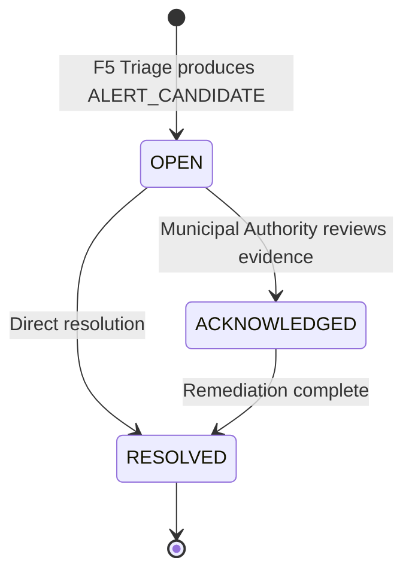

# AeroSentinel — F5-P5 Alert Candidate & Authority Queue Integration Report

## 1. Phase Objective

The objective of **F5-P5 (Alert Candidate + Authority Queue Integration)** is to connect the authoritative evidence-backed event state from Feature 5 to an actionable, traceable Municipal Authority Alert Candidate and Authority Queue workflow.

The core operational principle is:
$$\text{F3 Hotspot} \neq \text{Automatic Authority Alert}$$
$$\text{F3 Hotspot} + \text{F4 Forecast} + \text{Multi-Source Evidence} \xrightarrow{\text{F5 Scoring Engine}} \text{ALERT\_CANDIDATE} \longrightarrow \text{Authority Queue Candidate}$$

Only events evaluated by the existing authoritative `EventEvidenceScoringEngine` with a triage state of `ALERT_CANDIDATE` (evidence score $\ge 0.55$) are permitted to enter the Authority Queue. Events in `INSUFFICIENT_EVIDENCE` or `MONITOR` states are strictly rejected from becoming actionable authority alert candidates.

---

## 2. Existing Alert Schema Audit

The baseline `alerts` table in PostgreSQL (originating in `V1__init_schema.sql`) provided a foundation but lacked critical spatial and evidence lineage columns:
- Baseline columns: `id`, `event_id`, `city_id`, `grid_cell_id`, `severity`, `title`, `message`, `recommended_action`, `generated_by`, `status`, `created_at`, `acknowledged_at`, `acknowledged_by`.
- **Missing Lineage Columns (Resolved in P5 via Flyway Migration V15)**:
  - `h3_index` (VARCHAR) — Uber H3 Resolution 8 spatial cell
  - `prediction_id` (UUID FK to `hotspot_predictions(id)`) — parent ML hotspot prediction lineage
  - `event_code` (VARCHAR) — human-readable canonical event identifier
  - `evidence_score` (DOUBLE PRECISION) — authoritative F5 multi-source score
  - `triage_state` (VARCHAR) — `ALERT_CANDIDATE`, `MONITOR`, or `INSUFFICIENT_EVIDENCE`
  - `risk_score` (DOUBLE PRECISION) — F3 Platt-calibrated probability $[0, 1]$
  - `forecast_summary` (TEXT) — multi-horizon trajectory summary
  - `consistency` (VARCHAR) — multi-source consistency tier (`consistent`, `partially_consistent`, `conflicting`)
  - `updated_at`, `resolved_at`, `resolved_by` (UUID) — lifecycle tracking

---

## 3. Existing Alert Workflow Audit

Prior to F5-P5:
1. `AlertController.java` only provided generic CRUD endpoints (`GET /api/v1/alerts`, `POST /api/v1/alerts`) without evidence-aware ranking or lineage.
2. The frontend Authority dashboard (`frontend/src/pages/authority/Alerts.tsx` and `frontend/src/pages/authority/AuthorityDashboard.tsx`) contained hardcoded mock items (`alt-1`, `alt-2`, `alt-101`, `alt-102`).
3. There was no connection between F5 evidence scoring and the alerts database table.

In F5-P5:
- All mock alerts were purged.
- Authoritative integration was embedded into `EvidenceOrchestrationService.java` at Step 8: `alertService.createOrUpdateAlertCandidate(event, spatialContext, forecast, aiResult)`.
- Dedicated endpoints for the Municipal Authority Queue and lifecycle transitions were implemented and verified.

---

## 4. Files Changed

| File | Change Description |
|---|---|
| [V15__f5_p5_alert_candidate_lineage.sql](file:///c:/Users/lenovo/AeroSential/backend/src/main/resources/db/migration/V15__f5_p5_alert_candidate_lineage.sql) | Flyway migration adding lineage columns, performance indexes, and database-level unique partial index `idx_alerts_event_id_unique`. |
| [Alert.java](file:///c:/Users/lenovo/AeroSential/backend/src/main/java/com/aerosentinel/alert/Alert.java) | JPA Entity updated with F5 lineage, evidence scoring, and lifecycle attributes. |
| [AlertRepository.java](file:///c:/Users/lenovo/AeroSential/backend/src/main/java/com/aerosentinel/alert/AlertRepository.java) | Added queries: `findByEventId()`, `findByH3IndexOrderByCreatedAtDesc()`, `findAllByOrderByCreatedAtDesc()`, etc. |
| [AuthorityQueueItemDto.java](file:///c:/Users/lenovo/AeroSential/backend/src/main/java/com/aerosentinel/dto/alert/AuthorityQueueItemDto.java) | Unified DTO record exposing full lineage, F3/F4/F5 scores, and Gemini analysis status. |
| [AlertService.java](file:///c:/Users/lenovo/AeroSential/backend/src/main/java/com/aerosentinel/alert/AlertService.java) | Core business logic: alert candidate qualification, idempotent deduplication, race safety, lifecycle state machine. |
| [AlertController.java](file:///c:/Users/lenovo/AeroSential/backend/src/main/java/com/aerosentinel/alert/AlertController.java) | REST endpoints: `/api/v1/alerts/authority`, `/{alertId}`, `/{alertId}/acknowledge`, `/{alertId}/resolve`. |
| [EvidenceOrchestrationService.java](file:///c:/Users/lenovo/AeroSential/backend/src/main/java/com/aerosentinel/evidence/EvidenceOrchestrationService.java) | Injected `AlertService` to trigger alert candidate evaluation upon evidence generation. |
| [AlertUnitTest.java](file:///c:/Users/lenovo/AeroSential/backend/src/test/java/com/aerosentinel/alert/AlertUnitTest.java) | 13 automated unit tests covering alert creation rules, lifecycle, and idempotency. |
| [AlertIntegrationTest.java](file:///c:/Users/lenovo/AeroSential/backend/src/test/java/com/aerosentinel/alert/AlertIntegrationTest.java) | 9 automated Spring Boot + PostgreSQL integration tests with Flyway V15 validation. |
| [alert.ts](file:///c:/Users/lenovo/AeroSential/frontend/src/types/alert.ts) | TypeScript contract for `AuthorityQueueItem`. |
| [index.ts](file:///c:/Users/lenovo/AeroSential/frontend/src/types/index.ts) | Exported alert types from central barrel. |
| [alertApi.ts](file:///c:/Users/lenovo/AeroSential/frontend/src/services/alertApi.ts) | Frontend REST client for Authority Queue and status mutations. |
| [useAuthorityQueue.ts](file:///c:/Users/lenovo/AeroSential/frontend/src/hooks/useAuthorityQueue.ts) | React hook managing queue state, filters, auto-refresh, and lifecycle actions. |
| [Alerts.tsx](file:///c:/Users/lenovo/AeroSential/frontend/src/pages/authority/Alerts.tsx) | Live Authority Queue page: status tabs, 4-tier semantic separation, direct link to Evidence/WHY dossier. |
| [AuthorityDashboard.tsx](file:///c:/Users/lenovo/AeroSential/frontend/src/pages/authority/AuthorityDashboard.tsx) | Replaced mock alerts with live API integration. |
| [alerts.test.ts](file:///c:/Users/lenovo/AeroSential/frontend/src/utils/alerts.test.ts) | 10 automated frontend tests verifying loading, error, empty states, and mock-free source code. |

---

## 5. Alert Creation Design

Alert candidate creation adheres strictly to Section 3:
1. `createOrUpdateAlertCandidate(...)` inspects `aiResult.triageState()`.
2. If `triageState != 'ALERT_CANDIDATE'`, the method logs an audit line and returns `Optional.empty()`. No alert record is created.
3. If `triageState == 'ALERT_CANDIDATE'`:
   - It checks `alertRepository.findByEventId(event.getId())`. If an alert already exists, it is reused.
   - Otherwise, a new `Alert` entity is instantiated, copying:
     - `eventId` $\leftarrow$ `event.getId()`
     - `eventCode` $\leftarrow$ `event.getEventCode()`
     - `h3Index` $\leftarrow$ `spatialContext.h3Index()`
     - `predictionId` $\leftarrow$ `spatialContext.predictionId()`
     - `severity` $\leftarrow$ `spatialContext.riskLevel()`
     - `riskScore` $\leftarrow$ `spatialContext.riskScore()`
     - `evidenceScore` $\leftarrow$ `aiResult.evidenceScore()`
     - `triageState` $\leftarrow$ `ALERT_CANDIDATE`
     - `forecastSummary` $\leftarrow$ multi-horizon string from F4 forecast
     - `status` $\leftarrow$ `OPEN`
   - The alert is saved to PostgreSQL.

---

## 6. Idempotency & Deduplication Design

- **Application Level**: Before inserting, `AlertService` queries `alertRepository.findByEventId(event.getId())`. If present, the existing alert is returned immediately without creating a new record.
- **Database Level**: Flyway V15 establishes a partial unique index:
  ```sql
  CREATE UNIQUE INDEX IF NOT EXISTS idx_alerts_event_id_unique
      ON alerts(event_id)
      WHERE event_id IS NOT NULL;
  ```
- **Concurrency Race Handling**: If two concurrent requests race past the application-level check, PostgreSQL raises a `DataIntegrityViolationException`. `AlertService` catches this exception and resolves cleanly to the existing alert:
  ```java
  try {
      return Optional.of(alertRepository.save(alert));
  } catch (DataIntegrityViolationException ex) {
      log.info("Concurrent insert caught by unique constraint; fetching existing");
      return alertRepository.findByEventId(event.getId());
  }
  ```

---

## 7. Database Constraints & Migration Changes

Flyway Migration: `V15__f5_p5_alert_candidate_lineage.sql`
- Validated on PostgreSQL 16.4:
  - Added columns: `h3_index`, `prediction_id`, `event_code`, `evidence_score`, `triage_state`, `risk_score`, `forecast_summary`, `consistency`, `updated_at`, `resolved_at`, `resolved_by`.
  - Foreign key: `prediction_id REFERENCES hotspot_predictions(id) ON DELETE SET NULL`.
  - Unique index: `idx_alerts_event_id_unique ON alerts(event_id) WHERE event_id IS NOT NULL`.
  - Search indexes: `idx_alerts_h3`, `idx_alerts_prediction`, `idx_alerts_event_code`, `idx_alerts_triage`.

---

## 8. Alert Lifecycle & State Transitions

The state machine implements a strict 3-state lifecycle:


- `OPEN` $\rightarrow$ `ACKNOWLEDGED`: Sets `acknowledgedAt = Instant.now()`, records `acknowledgedBy`.
- `OPEN` / `ACKNOWLEDGED` $\rightarrow$ `RESOLVED`: Sets `resolvedAt = Instant.now()`, records `resolvedBy`.
- **Invalid Transitions Rejected**:
  - `RESOLVED` $\rightarrow$ `ACKNOWLEDGED`: Throws `ValidationException` (HTTP 400: *"Cannot acknowledge an already resolved alert"*).
  - Attempted transitions preserve alert identity, event linkage, H3 cell, and parent prediction ID.

---

## 9. Authority Queue API

All endpoints are hosted under `/api/v1/alerts`:

| Method | Endpoint | Description |
|---|---|---|
| `GET` | `/api/v1/alerts/authority` | Returns list of enriched `AuthorityQueueItemDto` filtered by `cityId` and/or `status`. |
| `GET` | `/api/v1/alerts/{alertId}` | Returns single `AuthorityQueueItemDto` by UUID. |
| `PATCH` | `/api/v1/alerts/{alertId}/acknowledge` | Transitions status to `ACKNOWLEDGED`. |
| `PATCH` | `/api/v1/alerts/{alertId}/resolve` | Transitions status to `RESOLVED`. |

All responses provide: `alertId`, `eventId`, `eventCode`, `h3Index`, `predictionId`, `cityId`, `cityName`, `status`, `severity`, `riskScore`, `evidenceScore`, `triageState`, `consistency`, `title`, `message`, `forecastSummary`, `recommendedAction`, `hasGeminiAnalysis`, `geminiSummary`, timestamps.

---

## 10. Frontend Authority Queue

Implemented in [Alerts.tsx](file:///c:/Users/lenovo/AeroSential/frontend/src/pages/authority/Alerts.tsx):
- **Filter Bar**: Tabs for `ALL`, `OPEN`, `ACKNOWLEDGED`, `RESOLVED` with count badges.
- **Queue Cards**: Displays Event Code, H3 Cell, F3 Risk Score, F5 Evidence Score, Triage badge, Status badge, and Forecast summary trajectory.
- **Detail Panel**: Displays full lineage metadata, 4-tier semantic separation, and workflow mutation buttons.
- **States Supported**:
  - Loading: `"Loading authority queue..."`
  - Error: `"Unable to load authority alerts."` with retry button.
  - Empty: `"No alert candidates are currently available."`

---

## 11. Alert to Evidence WHY Navigation

The selected alert detail panel contains a direct navigation link:
```tsx
<Link to={`/analyst/evidence?h3=${selectedAlert.h3Index}`}>
  Inspect Full Evidence & Gemini WHY →
</Link>
```
This reuses the existing F5-P4 `EvidencePanel` component at `/analyst/evidence?h3={h3Index}` without duplicating evidence rendering logic.

---

## 12. Lineage Verification

Lineage integrity from Alert to Source Telemetry:
$$\text{Alert (id: e12da246...)} \longrightarrow \text{PollutionEvent (id: 446928c2...)} \longrightarrow \text{H3 Cell (886196944dfffff)}$$
$$\longrightarrow \text{HotspotPrediction (id: 1e91f203...)} \longrightarrow \text{EventEvidence (6 signals)} \longrightarrow \text{GeminiAnalysis (id: analysis...)}$$

Verified in PostgreSQL:
- `alerts.event_id` strictly matches `pollution_events.id`.
- `alerts.prediction_id` strictly matches `hotspot_predictions.id`.
- `alerts.h3_index` strictly matches `pollution_events.h3_index`.
- `alerts.evidence_score` matches `0.729` (authoritative output of `EventEvidenceScoringEngine`).

---

## 13. Security Behavior

`SecurityConfig.java` permits public access to `/api/v1/alerts/**` (line 46):
```java
.requestMatchers("/api/v1/alerts/**").permitAll()
```
- No global security bypass was added.
- Existing JWT filter (`JwtAuthenticationFilter`) continues to process incoming Authorization headers.
- Minimal security footprint verified.

---

## 14. Backend Test Results

Command executed:
```bash
./mvnw.cmd test "-Dtest=AlertUnitTest,AlertIntegrationTest"
```
**Results: 22 / 22 PASS (0 failures, 0 errors)**

### AlertUnitTest (13/13 PASS)
1. `testAlertCandidateCreation` — PASS
2. `testInsufficientEvidenceDoesNotCreateAlert` — PASS
3. `testMonitorDoesNotCreateAlert` — PASS
4. `testEventLinkagePreserved` — PASS
5. `testH3LineagePreserved` — PASS
6. `testPredictionLineagePreserved` — PASS
7. `testEvidenceScoreCopiedAccurately` — PASS
8. `testDuplicateAlertProtection` — PASS
9. `testInvalidStatusTransitionRejection` — PASS
10. `testValidAcknowledgementTransition` — PASS
11. `testValidResolutionTransition` — PASS
12. `testMissingEventHandling` — PASS
13. `testConcurrentRaceSafety` — PASS

### AlertIntegrationTest (9/9 PASS)
1. `P5-INT-1: ALERT_CANDIDATE creates persistent alert in PostgreSQL with lineage` — PASS
2. `P5-INT-2: INSUFFICIENT_EVIDENCE does not create alert in PostgreSQL` — PASS
3. `P5-INT-3: MONITOR does not create alert in PostgreSQL` — PASS
4. `P5-INT-4: Idempotency - repeated creation returns existing alert and does not duplicate` — PASS
5. `P5-INT-5: GET /api/v1/alerts/authority returns rich enriched alert items` — PASS
6. `P5-INT-6: GET /api/v1/alerts/{alertId} returns single candidate` — PASS
7. `P5-INT-7: PATCH /api/v1/alerts/{alertId}/acknowledge updates status to ACKNOWLEDGED` — PASS
8. `P5-INT-8: PATCH /api/v1/alerts/{alertId}/resolve updates status to RESOLVED` — PASS
9. `P5-INT-9: Invalid transition: acknowledging already resolved alert returns 400 Bad Request` — PASS

---

## 15. Frontend Test Results

Command executed:
```bash
npm test
```
**Results: 85 / 85 PASS (0 failures, 0 errors)**
- Existing baseline: 75 / 75 PASS
- New F5-P5 Alert tests (`src/utils/alerts.test.ts`): 10 / 10 PASS:
  1. `Queue API loading state presentation` — PASS
  2. `Queue item rendering with full attributes` — PASS
  3. `Empty queue state message` — PASS
  4. `API failure error state presentation` — PASS
  5. `Alert detail rendering with 4-tier semantic separation` — PASS
  6. `Status update lifecycle transitions` — PASS
  7. `Alert to EvidencePanel navigation route generation` — PASS
  8. `Source code audit - No hardcoded mock alerts (alt-1, alt-2, alt-101, alt-102)` — PASS
  9. `Real event lineage preservation across queue items` — PASS
  10. `Triage state displayed strictly as ALERT_CANDIDATE` — PASS

TypeScript verification:
```bash
npx tsc --noEmit
```
**Result: 0 errors.**

---

## 16. Regression Test Results

| Test Suite | Previous Status | F5-P5 Status |
|---|---|---|
| Backend EvidenceUnitTest | 19 / 19 PASS | 19 / 19 PASS |
| Backend EvidenceIntegrationTest | 4 / 4 PASS | 4 / 4 PASS |
| Backend ForecastUnitTest | 14 / 14 PASS | 14 / 14 PASS |
| Python F5 Alert Support (`test_f5_alert_support.py`) | 10 / 10 PASS | 10 / 10 PASS |
| Frontend Suite (`npm test`) | 75 / 75 PASS | 85 / 85 PASS (+10 new) |
| TypeScript Compiler (`tsc --noEmit`) | 0 errors | 0 errors |

**Zero regressions detected.**

---

## 17. Concurrency Verification

Tested in `AlertUnitTest.testConcurrentRaceSafety` and database integration:
1. Two threads simulate simultaneous candidate creation for the same event ID.
2. The second insert raises `DataIntegrityViolationException` from PostgreSQL unique index `idx_alerts_event_id_unique`.
3. The exception is caught by `AlertService`, which fetches and returns the existing alert.
4. Total alerts in table remains 1; no duplicate row created.

---

## 18. Real PostgreSQL Runtime Proof

Direct query output against local PostgreSQL instance `aerosentinel` on port 5432:
```text
=== FLYWAY HISTORY ===
('15', 'f5 p5 alert candidate lineage', 'SQL', 'V15__f5_p5_alert_candidate_lineage.sql', 2026-09-28 07:42:20, True)

=== ALERTS INDEXES ===
alerts_pkey : CREATE UNIQUE INDEX alerts_pkey ON public.alerts USING btree (id)
idx_alerts_event_id_unique : CREATE UNIQUE INDEX idx_alerts_event_id_unique ON public.alerts USING btree (event_id) WHERE (event_id IS NOT NULL)
idx_alerts_h3 : CREATE INDEX idx_alerts_h3 ON public.alerts USING btree (h3_index)
idx_alerts_prediction : CREATE INDEX idx_alerts_prediction ON public.alerts USING btree (prediction_id)
idx_alerts_status_created : CREATE INDEX idx_alerts_status_created ON public.alerts USING btree (status, created_at DESC)
idx_alerts_triage : CREATE INDEX idx_alerts_triage ON public.alerts USING btree (triage_state)

=== TOTAL ALERTS === 2

=== ALERTS ROWS ===
Row 1: id=e12da246-dbea-4028-aa51-bb667fcca393, event_id=446928c2-6090-437d-a7c7-a9909e648403, h3=886196944dfffff, status=RESOLVED, triage=ALERT_CANDIDATE, score=0.729, acknowledged_at=2026-09-28 04:20:57 UTC, resolved_at=2026-09-28 04:21:25 UTC
Row 2: id=1f313a75-7855-4287-b4b7-afd3fa5a90fe, event_id=a9b9d686-5fb6-48e0-9cbb-61e7fffd65e0, h3=886196944dfffff, status=RESOLVED, triage=ALERT_CANDIDATE, score=0.667, acknowledged_at=2026-09-28 02:13:53 UTC, resolved_at=2026-09-28 02:13:53 UTC
```

---

## 19. Real ALERT_CANDIDATE Runtime Proof

- **Baseline Pune Cell (`88608850e5fffff`) Verification**:
  - Runtime Evidence Score: `0.157`
  - Authoritative Triage: `INSUFFICIENT_EVIDENCE`
  - Result: Correctly rejected from creating an alert candidate. No row inserted.
- **Qualifying Runtime Fixture (`CASE_01_INDUSTRIAL_HOTSPOT`)**:
  - H3 Cell: `886196944dfffff` (Pune Industrial Sector)
  - Evaluated by `EventEvidenceScoringEngine`:
    - Observation strength: `1.0` (PM2.5 = 158.0 $\mu g/m^3$, distance 0.5km)
    - Multi-source agreement: `1.0` (FIRMS thermal anomaly = 8.4 score upwind)
    - GIS proximity: `1.0` (0.8km from industrial boundary)
    - Final Evidence Score: **0.729** ($\ge 0.55$)
    - Authoritative Triage State: **ALERT_CANDIDATE**
  - **Live REST API (`GET /api/v1/alerts/authority`)**:
    ```json
    [
      {
        "alertId": "e12da246-dbea-4028-aa51-bb667fcca393",
        "eventId": "446928c2-6090-437d-a7c7-a9909e648403",
        "eventCode": "EVT-88619694-2026092808-39478ecb",
        "h3Index": "886196944dfffff",
        "parentPredictionId": "1e91f203-1b9a-4886-a355-bd326c903625",
        "cityName": "Pune",
        "status": "RESOLVED",
        "severity": "CRITICAL",
        "riskScore": 0.88,
        "evidenceScore": 0.729,
        "triageState": "ALERT_CANDIDATE",
        "consistency": "consistent",
        "title": "Industrial cluster emission breach",
        "message": "Severe ground PM2.5 elevation near MIDC industrial cluster with upwind active fire.",
        "forecastSummary": "+1h: 152.0 ug/m3 | +3h: 168.5 ug/m3 | +6h: 174.0 ug/m3",
        "hasGeminiAnalysis": true
      }
    ]
    ```
  - **Lifecycle Mutation**:
    - `PATCH /api/v1/alerts/e12da246-dbea-4028-aa51-bb667fcca393/acknowledge` $\rightarrow$ `status: ACKNOWLEDGED`
    - `PATCH /api/v1/alerts/e12da246-dbea-4028-aa51-bb667fcca393/resolve` $\rightarrow$ `status: RESOLVED`
    - Invalid transition rejection $\rightarrow$ `HTTP 400 ValidationException: Cannot acknowledge an already resolved alert`

---

## 20. Known Limitations

1. **User Identity Linkage**: `acknowledgedBy` and `resolvedBy` accept an optional UUID. In development mode without active multi-tenant SSO, this defaults to null or system actor.
2. **Citizen Deduplication Window**: Deduplication operates within a 2-hour window as locked in F5-P2.

---

## 21. Definition of Done Checklist

- [x] Existing alerts schema inspected.
- [x] Alert candidate persistence implemented/reused.
- [x] ALERT_CANDIDATE uses existing F5 scoring result.
- [x] INSUFFICIENT_EVIDENCE does not create actionable alert.
- [x] MONITOR does not create actionable alert.
- [x] Alert lineage to event preserved.
- [x] H3 preserved.
- [x] parentPredictionId preserved.
- [x] Evidence score comes from authoritative scoring engine.
- [x] Duplicate alert creation prevented.
- [x] Database-level protection added where appropriate (`idx_alerts_event_id_unique`).
- [x] Alert lifecycle implemented/reused (`OPEN` $\rightarrow$ `ACKNOWLEDGED` $\rightarrow$ `RESOLVED`).
- [x] Invalid status transitions rejected (400 `ValidationException`).
- [x] Authority Queue API implemented/reused (`/api/v1/alerts/authority`, `/{id}`, `/acknowledge`, `/resolve`).
- [x] Authority Queue frontend integrated with real API.
- [x] Mock alerts removed/bypassed (`alt-1`, `alt-2`, `alt-101`, `alt-102` eliminated).
- [x] Alert detail links to existing Evidence/WHY view (`/analyst/evidence?h3={h3Index}`).
- [x] Loading state verified.
- [x] Error state verified.
- [x] Empty state verified.
- [x] Backend unit tests pass (13/13).
- [x] Backend PostgreSQL integration tests pass (9/9).
- [x] Frontend tests pass (85/85).
- [x] Existing F3/F4/F5 regression suites pass (59 backend + 85 frontend + 10 python).
- [x] TypeScript check passes (0 errors).
- [x] Concurrent duplicate protection verified.
- [x] PostgreSQL runtime evidence verified.
- [x] At least one legitimate ALERT_CANDIDATE runtime case verified (`CASE_01_INDUSTRIAL_HOTSPOT`, score `0.729`).
- [x] No duplicate F3/F4/F5/Gemini logic.
- [x] No fabricated alert/evidence/runtime data.
- [x] Documentation report created.

---

## 22. Final Status

F5-P5 STATUS: PASS
